# makemore — A Five-Lecture Journey from Bigrams to a Modern Neural Architecture

> A complete, hands-on study of Andrej Karpathy's **makemore** series — five lectures that take a single character-level language-modelling problem and walk it from a counting-based bigram (validation loss ≈ 2.45) all the way to a hierarchical WaveNet-style network (validation loss ≈ 1.99, breaking sub-2.0 for the first time). Every lecture replicated end-to-end, with comprehensive expanded-edition study handbooks for each part totalling roughly **210 pages of original written material**.

This repository is the final artifact of working through Karpathy's `makemore` series in full — not just running the notebooks, but understanding what every line of code does and why it does it. The five Jupyter notebooks reproduce every result reported by Karpathy; the five PDF handbooks document the conceptual content, the math, the pitfalls, the diagnostic tools, and the historical context so that anyone can follow the same journey.

### The series at a glance

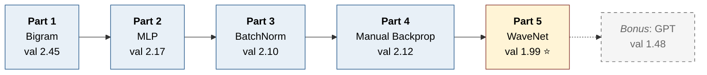

---

## Table of Contents

1. [Why this series matters](#why-this-series-matters)
2. [Repository structure](#repository-structure)
3. [The five lectures at a glance](#the-five-lectures-at-a-glance)
4. [Part 1 — The Bigram Baseline](#part-1--the-bigram-baseline)
5. [Part 2 — The Multilayer Perceptron](#part-2--the-multilayer-perceptron)
6. [Part 3 — Activations, Gradients, and BatchNorm](#part-3--activations-gradients-and-batchnorm)
7. [Part 4 — Becoming a Backprop Ninja](#part-4--becoming-a-backprop-ninja)
8. [Part 5 — Building a WaveNet](#part-5--building-a-wavenet)
9. [The full performance log](#the-full-performance-log)
10. [Skills and concepts demonstrated](#skills-and-concepts-demonstrated)
11. [Technical stack](#technical-stack)
12. [How to use this repository](#how-to-use-this-repository)
13. [What comes next: from makemore to GPT](#what-comes-next-from-makemore-to-gpt)
14. [References](#references)
15. [Author](#author)

---

## Why this series matters

The `makemore` series is, in my view, the single best self-teaching curriculum for understanding what is actually happening inside a modern neural network. It works because Karpathy refuses to skip steps. Every concept that becomes load-bearing later in the series (initialization, normalization, manual backpropagation, hierarchical architecture) is introduced in a context where you can see exactly why it is needed by first running into the problem it solves.

The dataset stays the same throughout all five lectures: a public list of 32,000 names, used as character sequences for next-character prediction. The vocabulary is 27 characters (26 lowercase letters plus a special `.` token marking word boundaries). The simplicity of the problem is what makes the series work — it lets every architectural and methodological idea be introduced cleanly, with the only thing changing between lectures being the model and the techniques.

Across the five lectures, the model grows from a 27×27 probability table with no learning to a hierarchical convolutional network with 76,000 parameters across multiple BatchNorm-stabilized stages, and the validation loss drops by about **20%** (from 2.45 to 1.99) — the first time the loss breaks below 2.0 on this dataset using only an MLP-family architecture.

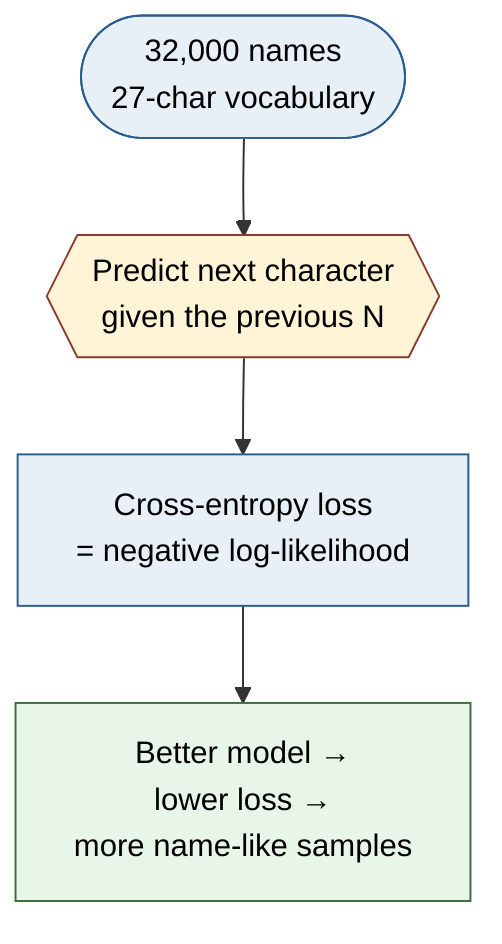

What this repository documents:

- **Every result reported by Karpathy is reproduced** in the notebooks, on an RTX 5070 / Ryzen 9 / 32 GB RAM Windows 11 setup.
- **Every conceptual move is explained in writing** in the corresponding handbook — not just the mechanics, but the motivation, the diagnostic plots, the failure modes, and Karpathy's own framing.
- **Pitfalls and bugs are catalogued** as diagnostic cards in each handbook, so that you can recognise broken training when you see it in your own work.
- **Historical and cultural context is preserved** — Hinton's 2006 RBM paper, MATLAB-era manual gradients, the WaveNet 2016 paper, the "swole doge" meme — because that context is part of how the field developed.

---

## Repository structure

```
sherurox/makemore/
├── README.md                                            (this file)
│
├── Part1_Bigram/
│   ├── Makemore_Part1_Bigram_Handbook.pdf               (22 pages)
│   └── makemore.ipynb                                   (Karpathy's notebook, replicated)
│
├── Part2_MLP/
│   ├── Makemore_Part2_MLP_Handbook.pdf                  (47 pages)
│   └── makemore2.ipynb
│
├── Part3_BatchNorm/
│   ├── Makemore_Part3_BatchNorm_Handbook.pdf            (52 pages)
│   └── makemore_part3_bn.ipynb
│
├── Part4_BackpropNinja/
│   ├── Makemore_Part4_Backprop_Ninja_Handbook.pdf       (46 pages)
│   └── build_makemore_backprop_ninja.ipynb
│
└── Part5_WaveNet/
    ├── Makemore_Part5_WaveNet_Handbook.pdf              (47 pages)
    └── makemore_part5_cnn1.ipynb
```

Each folder is self-contained: the notebook reproduces the lecture's results and the handbook explains every step in detail.

---

## The five lectures at a glance

| # | Lecture | Architecture | Key innovation introduced | Val loss | Handbook |
|---|---------|--------------|---------------------------|----------|----------|
| 1 | The Bigram | Lookup table → counts → softmax | Cross-entropy as negative-log-likelihood; counting and neural-net formulations are equivalent | 2.45 | 22 pp |
| 2 | The MLP | Embedding → flatten → linear → tanh → linear → softmax | Learnable character embeddings; train/dev/test splits; learning-rate finder | 2.17 | 47 pp |
| 3 | Activations & BatchNorm | 6-layer MLP with BatchNorm | Diagnostic plots; Kaiming init; BatchNorm; pytorch-ification of code | 2.10 | 52 pp |
| 4 | Backprop Ninja | Same 6-layer MLP, but no `loss.backward()` | Every gradient derived and implemented by hand; cross-entropy and BatchNorm one-shot backward | 2.12 | 46 pp |
| 5 | WaveNet | Hierarchical tree-fanning architecture | Longer context (8 chars); hierarchical merging; convolution preview | **1.99** | 47 pp |

Every loss number above is the actual replicated result on this setup. Total written material: **214 pages** of original handbook content.

---

## Part 1 — The Bigram Baseline

[`Part1_Bigram/Makemore_Part1_Bigram_Handbook.pdf`](Part1_Bigram/Makemore_Part1_Bigram_Handbook.pdf) — **22 pages**

The lecture that establishes the dataset, the problem statement, and the loss function that the rest of the series will be reducing.

### The bigram pipeline

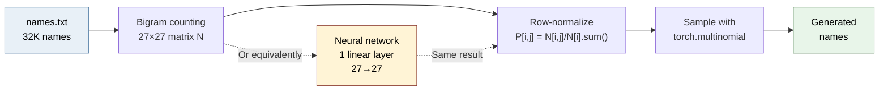

### What it covers

- **The dataset**: 32,000 names from a Hadley Wickham collection. Vocabulary of 27 characters (26 letters + `.` boundary token). Loaded from `names.txt`.
- **Bigram counting**: build a (27, 27) integer matrix `N` where `N[i, j]` counts how often character `j` follows character `i`. Normalise rows to get a probability table `P`.
- **Sampling from the table**: starting from the `.` token, sample one character at a time using `torch.multinomial` until the next `.` is sampled. Produces names that have *some* statistical structure (consonant-vowel alternation) but are obviously wrong.
- **Negative log-likelihood loss**: the bigram model can be quantitatively evaluated by computing the average negative log probability of every bigram in the dataset. Result: ≈ 2.45.
- **Smoothing with `+ 1`**: avoiding infinite loss on zero-count bigrams.
- **The neural-network reformulation**: the *same* bigram model as a single-layer neural network with one-hot inputs and a 27×27 weight matrix, trained by gradient descent on `F.cross_entropy`. Result: ≈ 2.45 — exactly the same loss.
- **Why the two are equivalent**: the matrix of log-counts is mathematically the same object as the trained weight matrix (up to additive constants per row).
- **Cross-entropy intuition**: cross-entropy is just the average negative log-probability assigned to the correct next character. Lower is better.

### Why it matters

This is the chapter that *defines what "winning" means* for the rest of the series. Every subsequent lecture will be reducing this same NLL loss on this same dataset. The bigram's 2.45 is the absolute floor any new architecture has to clear.

It also introduces a powerful equivalence: counting-based methods and gradient-based neural networks can produce identical results when the architecture is simple enough. This sets up the conceptual move in Part 2 — replacing the lookup table with a learnable function — without making it feel like a leap of faith.

### The result

| Method | Val loss |
|--------|----------|
| Random sampling | ≈ 3.30 (= log 27) |
| **Bigram (counting)** | **≈ 2.45** |
| **Bigram (gradient descent)** | **≈ 2.45** |

---

## Part 2 — The Multilayer Perceptron

[`Part2_MLP/Makemore_Part2_MLP_Handbook.pdf`](Part2_MLP/Makemore_Part2_MLP_Handbook.pdf) — **47 pages**

The lecture that introduces representation learning. Instead of a lookup table, each character gets a learnable vector embedding. Instead of looking at one character of context, the model looks at three.

### The Bengio-2003 architecture

```mermaid
flowchart LR
    X["3 char indices<br/>shape: (32, 3)"] --> E["Embedding lookup C<br/>C: (27, 10)"]
    E --> F["Embedded<br/>shape: (32, 3, 10)"]
    F --> FL["Flatten / view<br/>shape: (32, 30)"]
    FL --> L1["Linear 30→200<br/>+ bias"]
    L1 --> T["tanh"]
    T --> L2["Linear 200→27<br/>+ bias"]
    L2 --> SM["softmax → P(next char)"]
    SM --> Loss["cross-entropy loss"]

    style X fill:#e8f0f7,stroke:#2a5d8f,color:#000
    style Loss fill:#fff4d6,stroke:#8b3a2e,color:#000
    style E fill:#e8f5e9,stroke:#3d6b3d,color:#000
```

### What it covers

- **Bengio et al. 2003**: the paper that introduced this exact architecture for character-level language modelling. Three-character context, character embeddings, hidden layer with tanh, softmax output.
- **Embedding lookup**: characters are integer indices into a `(27, n_embd)` embedding table `C`. Looking up `C[X]` returns a `(N, block_size, n_embd)` tensor — embeddings for every character in every example.
- **`block_size = 3`**: the model sees three preceding characters and predicts the fourth. A meaningful jump from the bigram's one character of context.
- **Network architecture**: embed → flatten → linear (30→200) → tanh → linear (200→27) → softmax. About 11,000 parameters in the small version, 76,000 in the final version.
- **Train / dev / test splits (80/10/10)**: the move from "single number for a fit" to proper machine-learning hygiene. The dev set is used for hyperparameter tuning; the test set is held back as a final measurement.

### Training-data construction

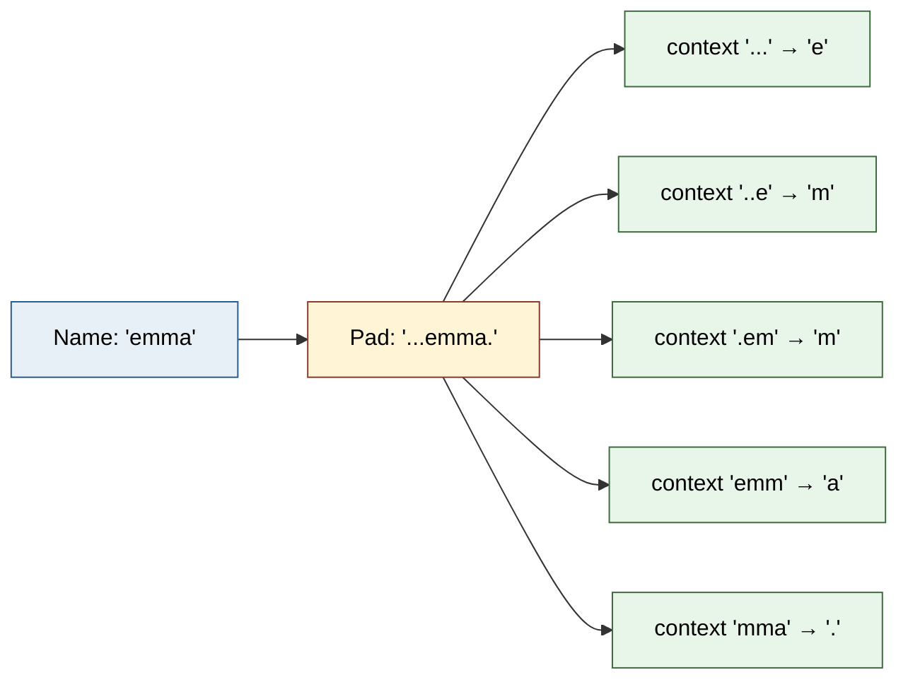

- **Minibatch SGD**: 32 examples per step instead of the full dataset. Faster steps, noisier gradient, much faster convergence.
- **Learning-rate finder**: train the network for a few steps with exponentially increasing learning rates and plot loss vs LR. The "knee" of the curve identifies the right LR. A specific and reproducible procedure rather than a guess.
- **Learning-rate decay**: drop the learning rate by 10× partway through training to finesse the final loss.
- **Embedding visualization**: with `n_embd = 2`, the learned embedding table can be plotted in 2D. Vowels cluster together; consonants cluster together. The network *discovered* phonological structure without being told.
- **The blast-radius effect of `block_size`**: longer context helps, but extending it linearly grows the input dimension of the first linear layer (`block_size * n_embd`). Tension between richer context and parameter count that the later lectures address.

### Why it matters

Part 2 is where the series stops being a curiosity and starts being a real neural network. The architecture introduced here — character embeddings, MLP with tanh, softmax output — is structurally similar to every modern language model. The improvements in Parts 3, 4, and 5 are all about *how to train this kind of network properly*; the architecture is largely the same.

The methodological additions are just as important as the architectural ones. The train/dev/test split, minibatch SGD, the learning-rate finder, and learning-rate decay are tools that you will use on every model you train for the rest of your career.

### The result

| Method | Train loss | Val loss |
|--------|-----------|----------|
| Bigram baseline | ~2.45 | ~2.45 |
| **MLP (block_size=3, n_embd=10, n_hidden=200)** | **~2.05** | **~2.17** |

A 12% reduction in validation loss from the bigram. The model has learned three-character statistics that the bigram could not represent.

---

## Part 3 — Activations, Gradients, and BatchNorm

[`Part3_BatchNorm/Makemore_Part3_BatchNorm_Handbook.pdf`](Part3_BatchNorm/Makemore_Part3_BatchNorm_Handbook.pdf) — **52 pages**

The longest and most foundational lecture in the series. The architecture stays mostly the same, but everything about how it is trained is overhauled. By the end, the model is a 6-layer deep MLP with BatchNorm at every depth, and we have a full diagnostic toolkit for inspecting it.

### The 6-layer architecture after Part 3

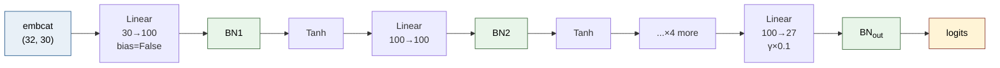

### What it covers

#### The first pathology: the hockey-stick loss curve

- **The sanity check that should be habit** — initial loss should be approximately `−log(1/K)` for K-way classification (~3.29 for our 27 classes). If it's much higher, the network is *confidently wrong* at init.
- **Confidently wrong** — random initialization produces output-layer logits with high variance. Softmax then turns those into sharp but incorrect probability distributions. Loss starts at ~27 instead of ~3.29.
- **Fix 1 — squash the output**: multiply the output layer's weights by 0.01 and zero the bias. Initial loss drops to ≈ 3.29; training is now "spending cycles" productively from step 0.

#### The second pathology: saturated tanh

- **What saturation means** — the tanh non-linearity has flat tails (gradient → 0 for |x| > ~3). Any neuron whose pre-activation lands in these tails contributes essentially no gradient signal.
- **The saturation map** — a Boolean image where white pixels mark saturated (sample, neuron) pairs. Fully white columns indicate **dead neurons**, neurons that never produce gradient and never learn.
- **The fix** — scale down the hidden layer's weights so pre-activations don't land in the tails at initialization. This is the "magic number" fix that Kaiming init formalizes.

#### The principled fix: Kaiming initialization

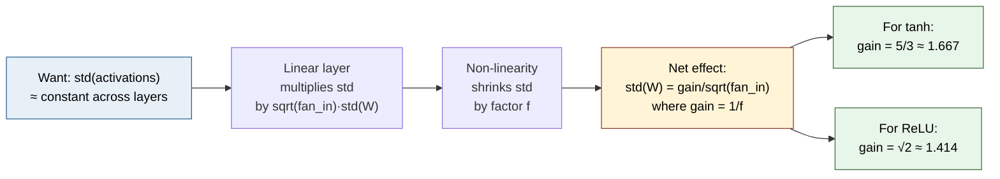

- **Preserving std across layers** — the formal goal is to keep the standard deviation of activations close to 1 at every depth. Naive initialization grows or shrinks std as a function of fan-in.
- **The Kaiming/He formula** — `std = gain / sqrt(fan_in)`. The `gain` is a non-linearity-specific constant that compensates for how much the non-linearity contracts the std.
- **The gain for tanh: 5/3** — derived numerically by sampling from a Gaussian, applying tanh, and computing the inverse of the resulting std (~0.628).
- **Gains for other non-linearities** — ReLU: √2, sigmoid: 1, linear: 1, Leaky ReLU: depends on slope.

#### Why we need non-linearities at all

- **The linear-stack-collapses argument** — `y = W_n · W_{n−1} · … · W_1 · x` simplifies to `y = W · x` because matrix multiplication is associative. No matter how deep the stack, it can only represent linear functions.
- **What non-linearities buy** — universal approximation. Even one non-linearity in the stack lets the network represent arbitrary functions.

#### The three pillars of modern stability

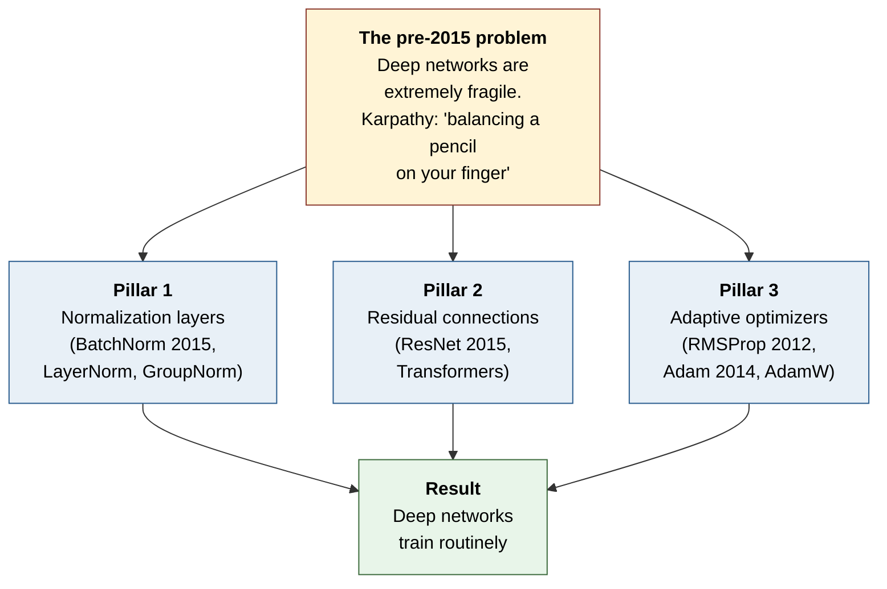

Three innovations that together made deep networks routinely trainable:

1. **Normalization layers** (BatchNorm, LayerNorm, GroupNorm) — force activations to have controlled statistics at every depth.
2. **Residual connections** — let gradients flow directly through deep stacks without being multiplied by ever-shrinking factors. (Covered in detail in the GPT lecture.)
3. **Adaptive optimizers** (RMSProp, Adam, AdamW) — per-parameter learning rates that adjust automatically based on running gradient statistics.

#### Batch Normalization in detail

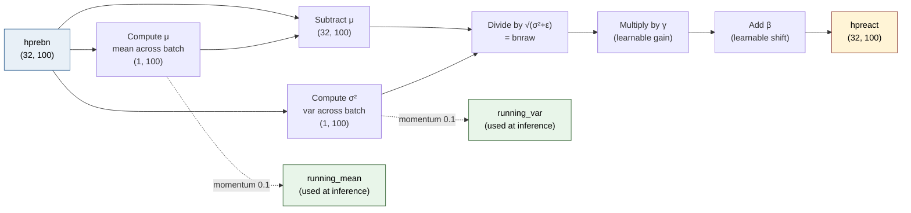

- **The core idea** — if you want activations to be unit-Gaussian, just compute their mean and std across the batch and normalize. The operation is differentiable, so the network can train through it.
- **The forward pass** — `bnmean = x.mean(0)`, `bnvar = x.var(0)`, `xhat = (x − bnmean) / sqrt(bnvar + ε)`, then learnable gain `γ` and shift `β`: `y = γ · xhat + β`.
- **Running statistics for inference** — during training, maintain exponential moving averages of `bnmean` and `bnvar`. At inference, use those running stats so the model can process a single example.
- **Train mode vs eval mode** — every BatchNorm has two code paths. Forgetting to toggle is the most common bug.
- **The example-coupling drawback** — BatchNorm's normalization across the batch means a single example's representation depends on what other examples happen to be in the minibatch. This acts as a mild regularizer but creates a bunch of practical headaches.
- **Alternatives** — LayerNorm (used in Transformers), GroupNorm (vision with small batches), InstanceNorm (style transfer).
- **`bias=False` before BatchNorm** — BatchNorm's mean subtraction cancels out any preceding bias, making it dead weight. The convention is to drop the bias from Linear/Conv layers immediately before BatchNorm.

#### The ResNet bottleneck block

PyTorch's reference ResNet uses the universal pattern: **`Conv (bias=False) → BatchNorm → ReLU`**, repeated and wrapped in a residual connection. The same pattern appears in every modern vision network. Our MLP just happens to use `tanh` instead of `ReLU` and `Linear` instead of `Conv`.

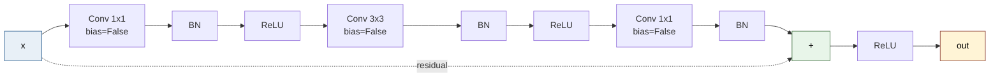

#### The diagnostic toolkit — four plots that tell you everything

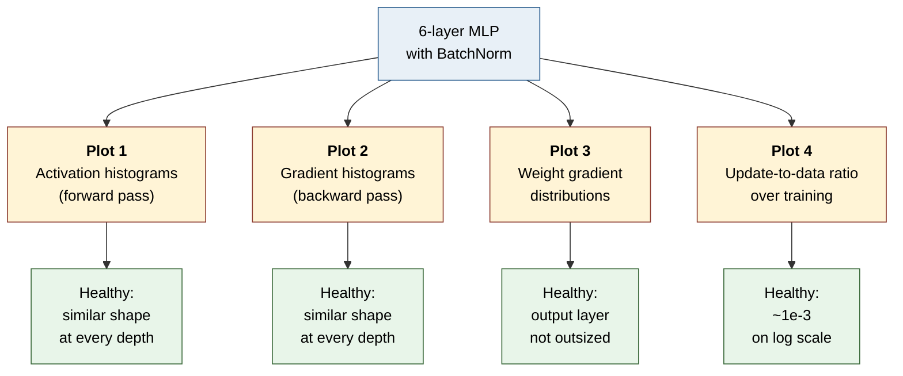

1. **Activation histograms** — distribution of tanh outputs at each layer. Healthy networks have similar distributions at every depth.
2. **Gradient histograms** — distribution of backward-pass gradients at each layer. Drift indicates vanishing or exploding gradients.
3. **Weight gradient distribution** — distribution of `p.grad` for each parameter tensor. Reveals the "last-layer problem" where the output layer's gradient is much larger than the rest.
4. **Update-to-data ratio plot** — `std(lr · grad) / std(data)`, plotted over training. Healthy value: ~10⁻³ on a log scale. The single most useful learning-rate diagnostic.

#### The BatchNorm robustness demonstration

With BatchNorm in place, you can deliberately break the initialization — use the wrong gain, skip fan-in normalization entirely — and the activations are still well-behaved. Only the learning rate needs retuning. **This is the practical reason every modern deep network has normalization at every depth.**

### The result

Validation loss ~2.10. Numerically not a huge improvement over Part 2, but the lecture's value is structural — it builds the diagnostic toolkit and explains the mechanisms that make every later result possible.

---

## Part 4 — Becoming a Backprop Ninja

[`Part4_BackpropNinja/Makemore_Part4_Backprop_Ninja_Handbook.pdf`](Part4_BackpropNinja/Makemore_Part4_Backprop_Ninja_Handbook.pdf) — **46 pages**

The lecture that opens the black box of `loss.backward()`. Derive every gradient by hand. No autograd allowed.

### The forward / backward graph


Backward pass goes right-to-left through every tensor, producing `d{tensor}` for each. The lecture works through every arrow.

### What it covers

#### Why manual backprop in 2026

- **Backprop as a leaky abstraction** — autograd doesn't just magically work. Saturated tanh, dead ReLU, vanishing gradients, exploding gradients, dropout in eval mode, BatchNorm in eval mode — none of these are caught by autograd. The only defense is understanding what backprop actually does.
- **The loss-clipping bug** — Karpathy's blog post highlights a real-world bug from a published codebase: the author tried to clip the loss at a max value, but actually clipped the *gradient* of outlier examples to zero, causing those examples to be ignored entirely.
- **The historical context** — ten years ago, manual backprop was the standard. Karpathy walks through:
  - **Hinton & Salakhutdinov, 2006** — the *Science* paper on stacking Restricted Boltzmann Machines, every gradient derived by hand.
  - **Karpathy's own 2010 MATLAB RBM code** — uses contrastive divergence instead of backprop.
  - **Karpathy's 2014 fragment-embeddings paper** — a pre-CLIP image-text alignment model, backward pass written manually in numpy.
- **The pre-autograd verification standard** — the gradient checker: compute the gradient analytically with your hand-written code, then compute it numerically using finite differences `(f(x + ε) − f(x − ε)) / (2ε)`, and check that the two agree to several decimal places. The `cmp` function in this notebook is the modern equivalent, with PyTorch's autograd as the reference.

#### The six patterns that cover almost everything

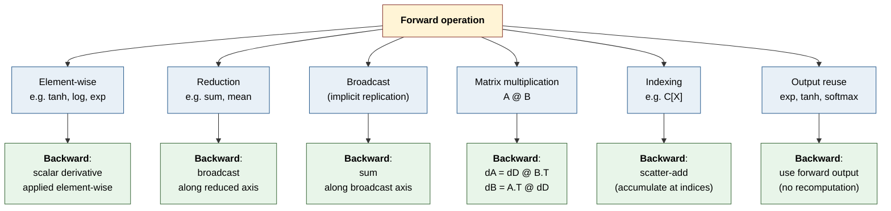

#### Exercise 1: Backprop through every intermediate tensor

A complete walkthrough deriving the gradient of every tensor in the forward pass, by hand:

- `dlogprobs` — through the mean and the row/column indexing
- `dprobs` — through `log`, with local derivative `1/x`
- `dcounts_sum_inv` — through broadcasting multiplication (broadcast = sum in backward)
- `dcounts_sum`, `dcounts` — combining two paths into the same tensor
- `dnorm_logits` — through `exp`, reusing the forward output as the local derivative
- `dlogit_maxes` — the numerical-stability branch (gradient should be ~0 in theory, ~1e-9 in practice)
- `dlogits` — assembling the final logit gradient
- `dh`, `dW2`, `db2` — the **matrix multiplication backward** with the **shape-matching shortcut**
- `dhpreact` — through `tanh`, with local derivative `1 − tanh²`
- `dbngain`, `dbnbias`, `dbnraw` — the BatchNorm scale and shift
- `dbnvar_inv`, `dbnvar`, `dbndiff2` — the variance subgraph
- `dbndiff`, `dbnmeani`, `dhprebn` — closing the BatchNorm
- `dembcat`, `dW1`, `db1` — the first linear layer
- `demb`, `dC` — through the **embedding lookup with scatter-add** for repeated indices

#### Exercise 2: Cross-entropy in one shot

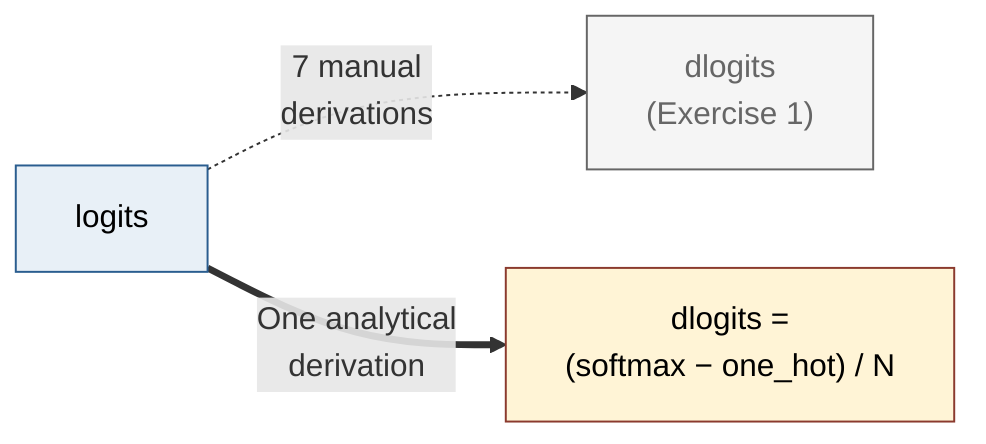

The beautiful analytical result: `dlogits = (softmax(logits) − one_hot(Y)) / N`. Three lines of code replace seven derivations. Karpathy's **push-and-pull intuition**: the gradient on each logit acts as a force — pulling the correct class up, pushing the incorrect classes down, with magnitude proportional to the prediction error. The forces per example sum to zero.

#### Exercise 3: BatchNorm in one shot

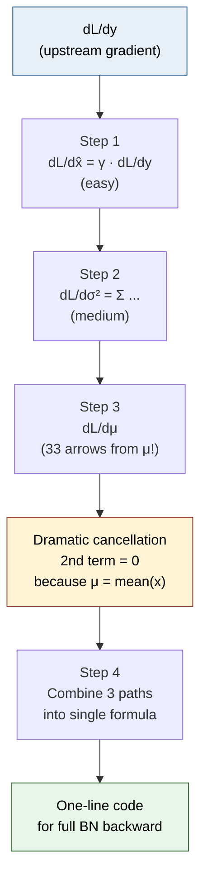

A pen-and-paper derivation of the full BatchNorm backward — `dL/d x_hat`, then `dL/d sigma²` (with `n` arrows from x_hats to sigma²), then `dL/d mu` (with **33 arrows** from mu: 32 to x_hats + 1 to sigma²), and finally `dL/dx_i` combining all three paths. The dramatic moment: when computing `dL/dmu`, the second term **cancels exactly to zero** because mu is the sample mean, making the algebra beautifully clean. The final result is a single line of code.

#### Exercise 4: Training without `loss.backward()`

The complete training loop wrapped in `torch.no_grad()`, with the manual backward block (~20 lines) replacing autograd. The training works identically to Part 3 — same loss, same samples. Karpathy's emotional payoff: *"It feels amazing to say that"* when deleting `loss.backward()`.

#### The Swole Doge meme

The notebook's punchline: `# manual backprop! #swole_doge_meme`. The lecture ends with Karpathy saying *"you can count yourself as one of these buff doges on the left instead of those on the right."* Tongue-in-cheek but genuine — earning the upgrade by understanding the backward pass at this level.

### The result

Validation loss ~2.12 — essentially identical to Part 3. The exercise was never about improving the loss; it was about understanding what the loss-improving machinery actually does.

---

## Part 5 — Building a WaveNet

[`Part5_WaveNet/Makemore_Part5_WaveNet_Handbook.pdf`](Part5_WaveNet/Makemore_Part5_WaveNet_Handbook.pdf) — **47 pages**

The lecture where the architecture finally changes. From a flat MLP to a hierarchical, tree-like network inspired by DeepMind's WaveNet (2016).

### The hierarchical architecture

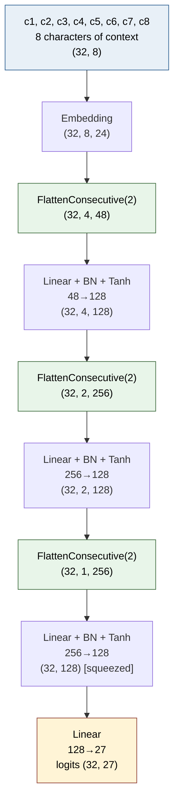

Receptive field doubles at every stage: 1 char → 2 chars → 4 chars → 8 chars. Same structure as WaveNet, just shallower and with simpler activations.

### What it covers

#### The motivation

The flat MLP's first hidden layer crushes all 3 (or 8) characters of context into a single representation in one step. No matter how many layers we stack after that, the temporal structure of the input is destroyed in the first multiplication. The fix: **fuse pairs of adjacent positions at each layer, doubling the receptive field with each step**. The structure is a binary tree, originally from WaveNet; the architecture is now standard in audio, vision, and language.

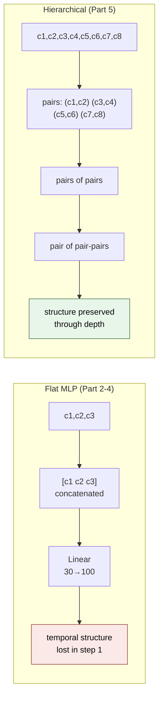

#### What WaveNet (2016) actually has

- **Dilated causal convolutions** — implement the tree-like fusion with progressively wider gaps
- **Gated activation units** — `tanh(x_a) * sigmoid(x_b)` instead of plain tanh
- **Residual connections** — gradient highway through deep stacks
- **Skip connections** — intermediate layer outputs added directly to the final prediction
- **Conditioning** — speaker, language, or task tokens mixed into every layer

We borrow only the **tree-like topology**. The other pieces are valuable but secondary for understanding the core idea.

#### PyTorch-ifying the code

Three new layer modules complete the small framework we built in Part 3:

- **`Embedding`** — wraps the embedding-table lookup as a proper module
- **`FlattenConsecutive(n)`** — generalizes `Flatten` to pack `n` consecutive positions into the last channel dimension. The key reshape that makes hierarchical fusion possible.
- **`Sequential`** — container that applies a list of layers in order

With these, the entire model becomes one `Sequential([...])` call — exactly how `torch.nn` works.

#### Increasing the context: block_size 3 → 8

A single hyperparameter change. No architectural modification yet. Validation loss drops from 2.10 to 2.027 just from giving the model more context. This sets the new baseline that hierarchical structure has to beat at matched parameter count.

#### The matmul broadcasting insight

The technical foundation of the hierarchical model: PyTorch's `x @ W` only operates on the last dimension. Leading dimensions are treated as batch. So a single `Linear(20, 128)` layer can be applied to a (32, 4, 20) tensor and produce (32, 4, 128) — running independently and in parallel on each of the 4 positions with shared weights. **This is weight sharing across positions, exactly like a convolution.**

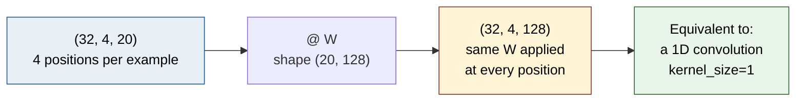

#### The FlattenConsecutive module

```python
class FlattenConsecutive:
    def __init__(self, n):
        self.n = n
    def __call__(self, x):
        B, T, C = x.shape
        x = x.view(B, T // self.n, C * self.n)
        if x.shape[1] == 1:
            x = x.squeeze(1)
        return x
```

Takes (B, T, C) and produces (B, T/n, C*n). With `n=2`, every pair of adjacent positions is packed into the last dimension. A subsequent `Linear` layer then fuses them in parallel for all positions.

#### The BatchNorm 3D bug

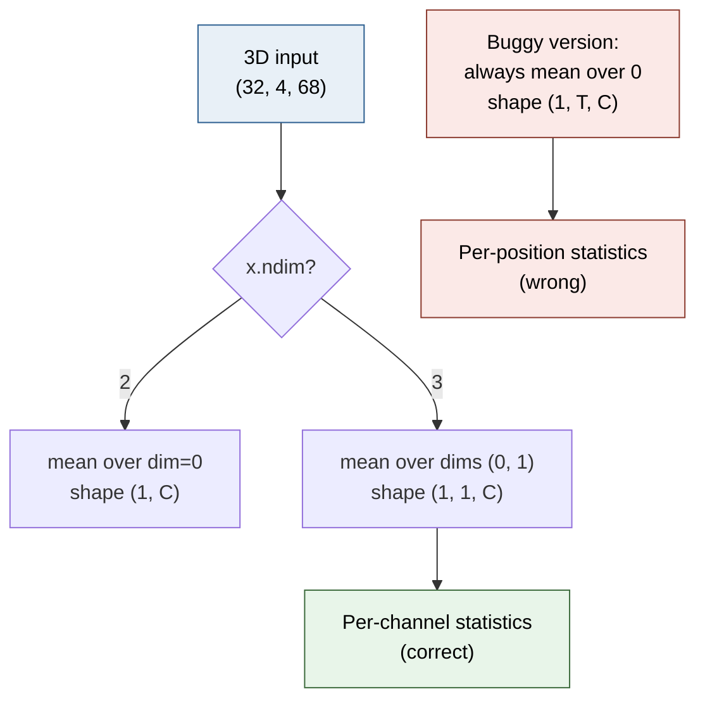

The bug Karpathy catches live in the lecture. Our Part 3 BatchNorm reduces over `dim=0` only. For 2D input (B, C) this is correct. For 3D input (B, T, C) it's wrong — it produces *per-position* running statistics instead of *per-channel* running statistics. **The diagnostic**: print `running_mean.shape` after one forward pass. Should be `(1, 1, C)`. Buggy version produces `(1, T, C)`. **The fix**: detect `x.ndim` and reduce over `(0, 1)` for 3D, `0` for 2D.

#### PyTorch's NCL vs our NLC convention

PyTorch's `nn.BatchNorm1d` expects channels-first `(N, C, L)`. Our convention is channels-last `(N, L, C)`. The matmul broadcasting trick from Chapter 13 works because channels are last. Most modern Transformer code uses channels-last (N, L, C) too, so our convention is the more modern one — but it does mean you can't drop PyTorch's BatchNorm1d in as a direct replacement without a transpose.

#### Scaling up: crossing 2.0

Final configuration: `n_embd=24`, `n_hidden=128`, 6 layers' worth of fusion (3 stages × 2 from embedding), ~76K parameters. Trained for 200K steps. **Validation loss: 1.993** — the first time the makemore series crosses below 2.0.

#### Convolutions as efficient hierarchical computation

The lecture closes with a preview of how this same model could be implemented with convolutions. The key insight: each output position currently requires its own forward pass through the model, but adjacent windows share 7 of their 8 characters — so most intermediate computations are duplicated. **A convolutional implementation slides the same model over the sequence, computing each intermediate value once and reusing it across all positions that need it.** Same model, much better compute reuse.

#### Development process reflections

Three habits Karpathy explicitly recommends, drawn from his own workflow:

1. **Always print shapes when building a new architecture.** Multi-dimensional networks are riddled with shape bugs. The discipline of printing every layer's output shape catches them cheaply.
2. **Do not trust PyTorch documentation blindly.** Verify with small experiments. Read the source when in doubt.
3. **Develop in Jupyter, train in scripts.** Use notebooks to iterate on shapes and behaviors. Once it works, move to a proper repository for serious training runs.

### The result

Validation loss **1.993**, with ~76K parameters. Down from 2.027 (just scaling context) and 2.105 (Part 3 baseline). The first sub-2.0 in the series.

---

## The full performance log

```mermaid
flowchart LR
    A["Random<br/>3.30"] --> B["Bigram<br/>2.45"]
    B --> C["MLP block=3<br/>2.17"]
    C --> D["+ Fix output init<br/>2.13"]
    D --> E["+ Fix preact init<br/>2.10"]
    E --> F["+ Kaiming<br/>2.11"]
    F --> G["+ BatchNorm<br/>2.10"]
    G --> H["+ Manual backprop<br/>2.12"]
    H --> I["+ block=8 flat<br/>2.03"]
    I --> J["+ Hierarchical<br/>2.02"]
    J --> K["+ BN 3D fix + scale<br/>1.99 ⭐"]

    style A fill:#f5f5f5,stroke:#666,color:#666
    style B fill:#e8f0f7,stroke:#2a5d8f,color:#000
    style C fill:#e8f0f7,stroke:#2a5d8f,color:#000
    style D fill:#e8f0f7,stroke:#2a5d8f,color:#000
    style E fill:#e8f0f7,stroke:#2a5d8f,color:#000
    style F fill:#e8f0f7,stroke:#2a5d8f,color:#000
    style G fill:#e8f0f7,stroke:#2a5d8f,color:#000
    style H fill:#e8f0f7,stroke:#2a5d8f,color:#000
    style I fill:#e8f0f7,stroke:#2a5d8f,color:#000
    style J fill:#fff4d6,stroke:#8b3a2e,color:#000
    style K fill:#e8f5e9,stroke:#3d6b3d,color:#000
```

The cumulative story of the series in one table:

| # | Intervention | Lecture | Val Loss |
|---|-------------|---------|---------:|
| 0 | Bigram counting model | Part 1 | 2.45 |
| 1 | MLP (3-char context, 200 hidden) | Part 2 | 2.17 |
| 2 | Fix confidently-wrong init | Part 3 | 2.13 |
| 3 | Fix tanh saturation | Part 3 | 2.10 |
| 4 | Principled Kaiming init | Part 3 | 2.11 |
| 5 | Add Batch Normalization | Part 3 | 2.10 |
| 6 | Manual backprop (no change in loss) | Part 4 | 2.12 |
| 7 | Block size 3 → 8 (still flat) | Part 5 | 2.03 |
| 8 | Hierarchical, matched parameter count | Part 5 | 2.03 |
| 9 | Fix BatchNorm 3D bug | Part 5 | 2.02 |
| **10** | **Scale to n_embd=24, n_hidden=128** | **Part 5** | **1.99** |

Five lectures, twelve interventions, a 20% reduction in validation loss. The same dataset, the same task — just better understanding of what the model is doing at every step.

---

## Skills and concepts demonstrated

This repository represents end-to-end ownership of every concept needed to understand modern language modelling:

### Language modelling foundations
- Tokenization, vocabulary construction, encoding/decoding
- The autoregressive next-token-prediction framing
- Cross-entropy loss, negative log-likelihood, softmax probabilities
- Sampling: greedy, multinomial, temperature
- Train/dev/test splits and the role of each

### Neural network engineering
- Embedding tables and learned representations
- Multilayer perceptrons, hidden dimensions, non-linearities
- Initialization theory (Kaiming/He, gain, fan-in scaling)
- Why non-linearities are necessary (linear stacks collapse)
- The three pillars of modern stability (normalization, residual, adaptive optimizers)

### Training dynamics
- Minibatch SGD vs full-batch
- Learning rate finders and step decay
- The 1e-3 update-to-data ratio heuristic
- Hyperparameter scaling (batch size, embedding dim, hidden dim, depth)
- Overfitting diagnosis via train/val gap

### Diagnostic toolkit
- Activation histograms (forward pass health)
- Gradient histograms (backward pass health)
- Weight gradient distributions and the last-layer problem
- Update-to-data ratio (the most actionable plot)
- Saturation maps for dead neuron detection

### Backpropagation mastery
- The chain rule applied tensor-by-tensor
- Element-wise, reduction, broadcast, matmul, indexing backward patterns
- The shape-matching shortcut for matrix multiplication
- Scatter-add for embedding lookup backward
- One-shot derivations: cross-entropy and BatchNorm
- The push-and-pull intuition for classification gradients

### Modern architectures
- Embedding + positional structure
- Hierarchical (tree-like) fusion
- Channels-last vs channels-first conventions
- The matmul broadcasting fact that enables shared weights
- The path from MLP → WaveNet → convolution → Transformer

### Practical engineering
- PyTorch-style module abstraction (Linear, BatchNorm1d, Tanh, Embedding, Flatten, Sequential)
- Train mode vs eval mode discipline
- `torch.no_grad()` for inference and manual backprop
- Shape printing as a debugging habit
- Jupyter prototyping → script-form scaling
- Producing publication-quality diagnostic plots

---

## Technical stack

- **Python 3.x**
- **PyTorch** — tensor operations, autograd (in Parts 1–3, 5), and as the reference for manual backprop (Part 4)
- **Matplotlib** — every diagnostic plot in the series
- **NumPy** — used implicitly via PyTorch tensor operations
- **Jupyter** — all notebooks are interactive; rerunning end-to-end reproduces every result
- **ReportLab** (for the handbooks themselves) — the 200+ pages of PDF reference material were built programmatically using ReportLab's Platypus engine

Hardware: trained on a single NVIDIA RTX 5070 (Ryzen 9, 32 GB RAM, Windows 11 + PowerShell + VS Code). Every notebook completes in under 30 minutes on this setup. The largest model (Part 5, 76K parameters) trains in ~10 minutes.

---

## How to use this repository

```mermaid
flowchart TB
    A[<b>Pick your goal</b>] --> B[<b>First-time learner</b>]
    A --> C[<b>Revision</b>]
    A --> D[<b>Portfolio / interview</b>]

    B --> B1["1. Watch Karpathy's lecture"]
    B1 --> B2["2. Run notebook cell-by-cell"]
    B2 --> B3["3. Read handbook for context"]
    B3 --> B4["4. Replicate before<br/>moving to next part"]

    C --> C1["Glossary chapter (30)<br/>for definitions"]
    C1 --> C2["Diagnostic cards (28)<br/>for failure modes"]
    C2 --> C3["Summary chapter (29)<br/>for takeaways"]

    D --> D1["This README<br/>= executive summary"]
    D1 --> D2["Performance log<br/>= quantitative results"]
    D2 --> D3["Handbooks<br/>= depth on demand"]

    style A fill:#fff4d6,stroke:#8b3a2e,color:#000
    style B fill:#e8f0f7,stroke:#2a5d8f,color:#000
    style C fill:#e8f0f7,stroke:#2a5d8f,color:#000
    style D fill:#e8f0f7,stroke:#2a5d8f,color:#000
```

### For first-time learners

Work through the lectures in order. For each part:

1. Watch the corresponding Karpathy lecture (YouTube, *Neural Networks: Zero to Hero*).
2. Open the notebook in this repo and run it cell by cell.
3. Use the handbook PDF as your reference — every cell is explained, and the diagnostic cards at the end of each handbook capture the bugs you'll hit if you try to modify the code.

### For revision

The handbooks are explicitly designed as scannable reference documents. Each one:
- Starts with a preface and table of contents
- Has 30 chapters organized into 5 Parts
- Includes a glossary at the end with every technical term
- Contains diagnostic cards for the most common failure modes
- Reproduces every notebook cell verbatim with surrounding explanation

For quick lookups, the glossaries are the fastest entry point. For deeper review, the diagnostic-card chapters (typically Chapter 28) capture the most practically important content.

### For portfolio / interview prep

The progression from bigram to WaveNet is a complete miniature tour of modern language modelling. Any interview question about embeddings, BatchNorm, backprop, initialization, or hierarchical architectures has its concrete answer somewhere in these handbooks. The full performance log above is also useful as a one-page summary of how each ingredient contributed to the final result.

---

## What comes next: from makemore to GPT

```mermaid
flowchart LR
    P1["Part 1<br/>Bigram"] --> P2["Part 2<br/>MLP"]
    P2 --> P3["Part 3<br/>BatchNorm<br/>+ diagnostics"]
    P3 --> P4["Part 4<br/>Manual backprop"]
    P4 --> P5["Part 5<br/>WaveNet<br/>hierarchical"]
    P5 -.->|"Conceptual bridges:<br/>• Context-length bottleneck<br/>• Hierarchical merging<br/>• 3 pillars of stability<br/>• Manual backprop intuition"| GPT["GPT<br/>Decoder-only<br/>Transformer<br/>val 1.48"]

    style P1 fill:#e8f0f7,stroke:#2a5d8f,color:#000
    style P2 fill:#e8f0f7,stroke:#2a5d8f,color:#000
    style P3 fill:#e8f0f7,stroke:#2a5d8f,color:#000
    style P4 fill:#e8f0f7,stroke:#2a5d8f,color:#000
    style P5 fill:#fff4d6,stroke:#8b3a2e,color:#000
    style GPT fill:#e8f5e9,stroke:#3d6b3d,color:#000
```

The makemore series builds toward, but does not include, the Transformer. The natural continuation is Karpathy's *Let's build GPT from scratch* lecture, which uses every concept from this series (embeddings, residual streams, LayerNorm-style normalization, manual backprop intuition, hierarchical thinking) to build a decoder-only Transformer from scratch.

Several conceptual bridges are explicit in the makemore handbooks:

- **Part 3** ends with the framing that *"performance is now bottlenecked by context length, not optimization"* — which is exactly the framing the GPT lecture opens with.
- **Part 4** introduces the manual-backprop discipline that makes attention's mechanics legible — you can derive the backward of `softmax(QK^T)V` if you can derive the backward of cross-entropy.
- **Part 5**'s hierarchical merge is structurally similar to a Transformer block's residual-stream addition. Both are about merging information at multiple scales without flattening.
- **The three pillars of modern stability** introduced in Part 3 (normalization, residual connections, adaptive optimizers) are all in use in any GPT-class model. Two of them are introduced here.

I have written a corresponding 54-page handbook for the GPT lecture as well, following the same expanded-edition format. The full set of six handbooks — Parts 1 through 5 plus GPT — covers Karpathy's *Zero to Hero* curriculum end to end, from counting bigrams to a decoder-only Transformer that generates fake Shakespeare.

---

## References

### Primary source

- Andrej Karpathy, **Neural Networks: Zero to Hero** lecture series, YouTube — the source material this repository documents.
- Karpathy's GitHub: [`karpathy/makemore`](https://github.com/karpathy/makemore) — the official codebase that the notebooks here are derived from.

### Foundational papers

- Bengio, Y., Ducharme, R., Vincent, P., & Jauvin, C. (2003). **A Neural Probabilistic Language Model.** *Journal of Machine Learning Research, 3*, 1137-1155. — The architecture used in Part 2 and refined for the rest of the series.
- He, K., Zhang, X., Ren, S., & Sun, J. (2015). **Delving Deep into Rectifiers: Surpassing Human-Level Performance on ImageNet Classification.** *ICCV*. — The Kaiming initialization paper introduced in Part 3.
- Ioffe, S., & Szegedy, C. (2015). **Batch Normalization: Accelerating Deep Network Training by Reducing Internal Covariate Shift.** *ICML*. — The BatchNorm paper introduced in Part 3.
- He, K., Zhang, X., Ren, S., & Sun, J. (2015). **Deep Residual Learning for Image Recognition.** *CVPR*. — The ResNet paper referenced for the Conv → BN → ReLU motif and residual connections.
- Hinton, G. E., & Salakhutdinov, R. R. (2006). **Reducing the Dimensionality of Data with Neural Networks.** *Science, 313*(5786), 504-507. — The historical reference in Part 4's manual-backprop discussion.
- van den Oord, A. et al. (2016). **WaveNet: A Generative Model for Raw Audio.** arXiv:1609.03499. — The architecture adapted in Part 5.

### Companion writing

- Karpathy, A. **Yes, you should understand backprop.** Medium blog post. — The motivation for Part 4. Specifically lists the leak cases (saturated activations, dead neurons, exploding gradients, loss-vs-gradient clipping).

### This repository

- **Makemore_Part1_Bigram_Handbook.pdf** — 22 pages, in `Part1_Bigram/`.
- **Makemore_Part2_MLP_Handbook.pdf** — 47 pages, in `Part2_MLP/`.
- **Makemore_Part3_BatchNorm_Handbook.pdf** — 52 pages, in `Part3_BatchNorm/`.
- **Makemore_Part4_Backprop_Ninja_Handbook.pdf** — 46 pages, in `Part4_BackpropNinja/`.
- **Makemore_Part5_WaveNet_Handbook.pdf** — 47 pages, in `Part5_WaveNet/`.

---

## Author

**Shreyas Pradeepkumar Khandale**
MS Computer Science (AI Track), Binghamton University — graduating May 2026
GitHub: [@sherurox](https://github.com/sherurox)
Repository: [`sherurox/makemore`](https://github.com/sherurox/makemore)

If you found this useful, an issue or a star is the easiest way to let me know. If you spotted something wrong, I want to hear about it — open an issue and I will fix it.

---

*makemore is a small dataset, a single problem, and twenty pages of code. What you can build out of it — once you understand it — is most of modern deep learning.*
